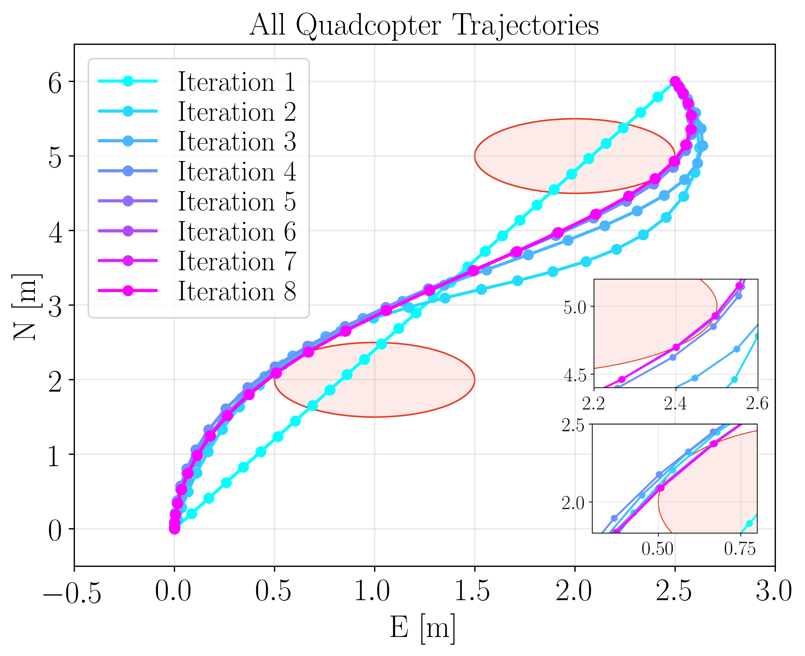
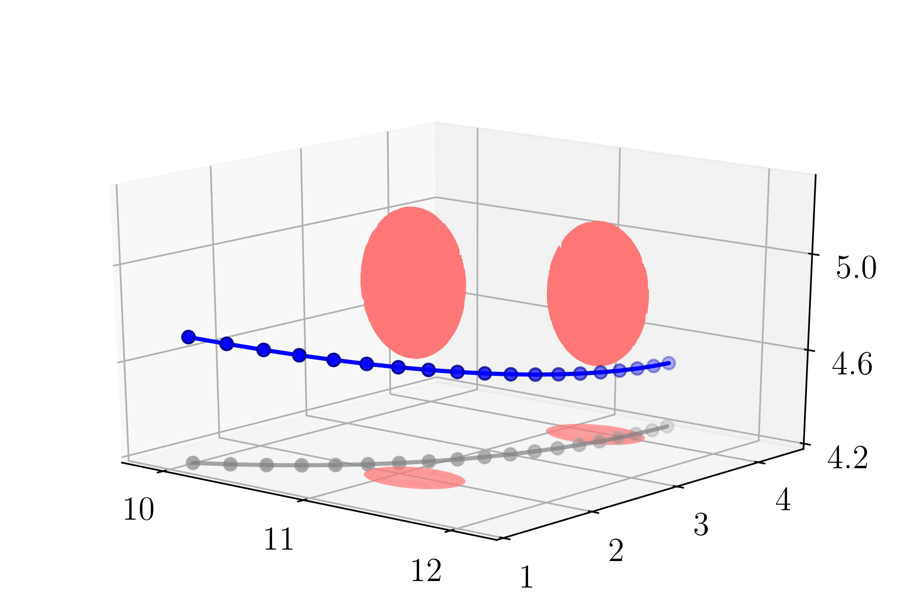

# GuSTO algorithm for quadrotor and Astrobee

## Description
Simplified implementation of GuSTO in Julia. Includes simulation examples of a quadrotor and Astrobee robot navigating on-board the International Space Station.

  
  
<!--    <em>Implementation of GuSTO to generate trajectories for a quadrotor and Astrobee navigating on-board the International Space Station.</em> -->

Tested with Julia 1.4.1

## Online notebook

Demo of Quadrotor: 

Demo of Astrobee: 
